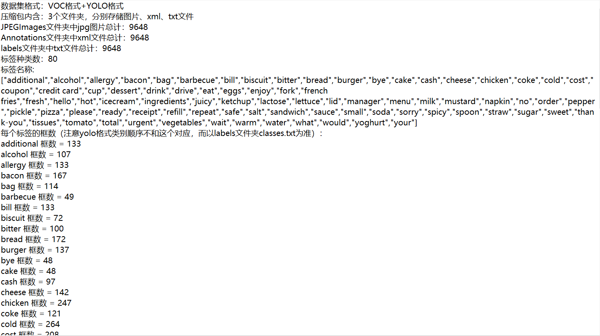
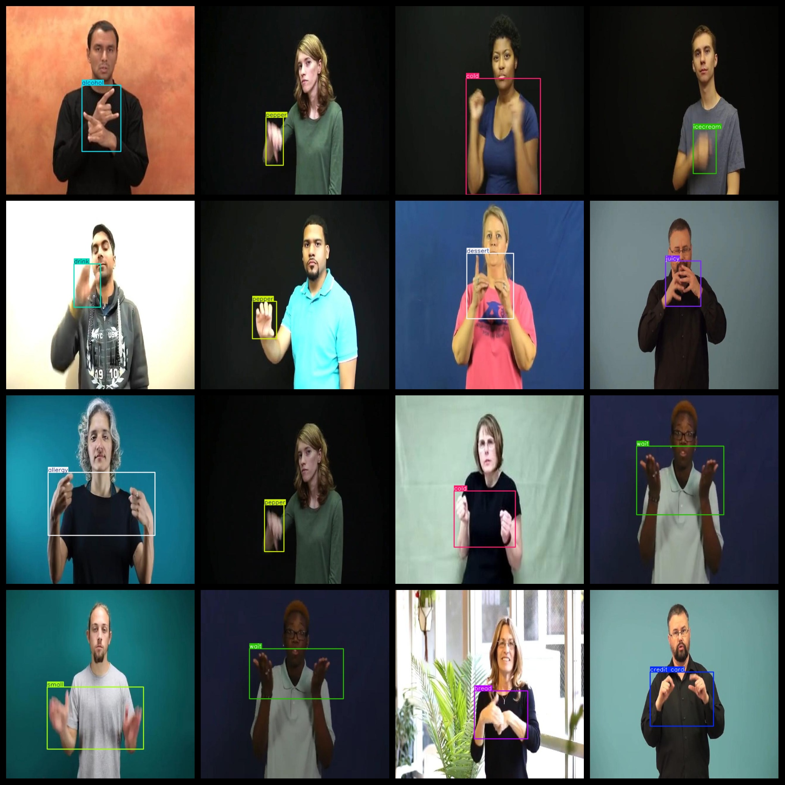
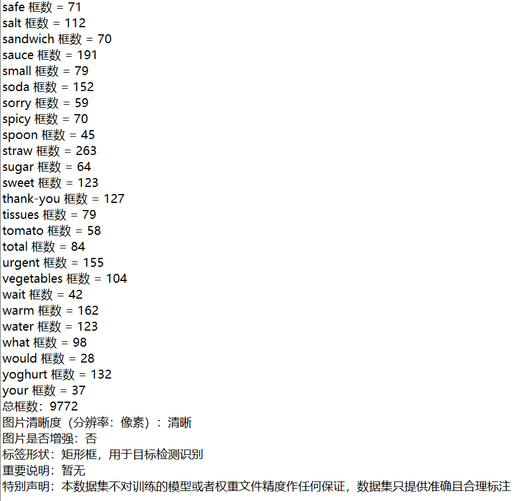

# [Object Detection] 80 typesHand Language Detection Dataset 9648 imagesYOLO+VOC

【Target Detection】80 Datasets of Sign Language Detection with 9648 Images in YOLO+VOC

This is a list of 80 datasets for target detection, including 9648 images in the YOLO and VOC (You Only Look Once and Visual Object Classes) format.

Annotation examples and image overview:

## Images

---

Here is a pay link on Stripe (https://buy.stripe.com/3cs8yP7sY87d0vu9AB). Please contact me lonlonago@foxmail.com after funding $89, and I will send you a complete data files, thank you!

